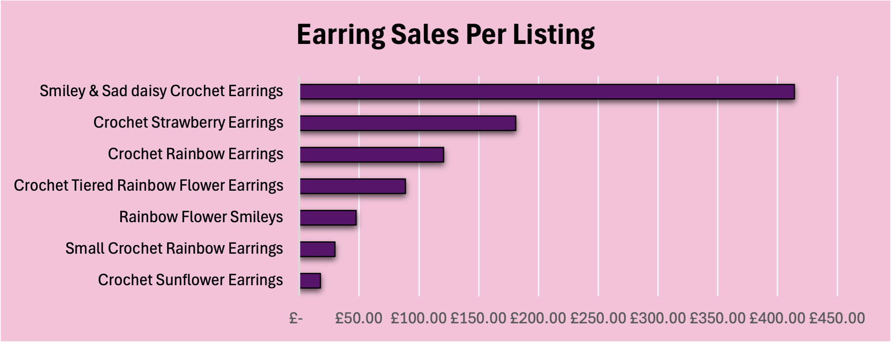
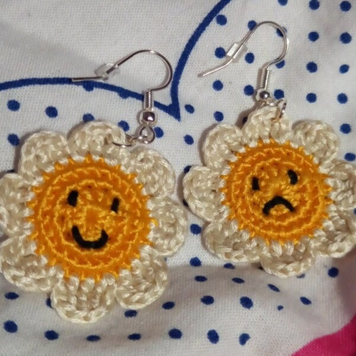
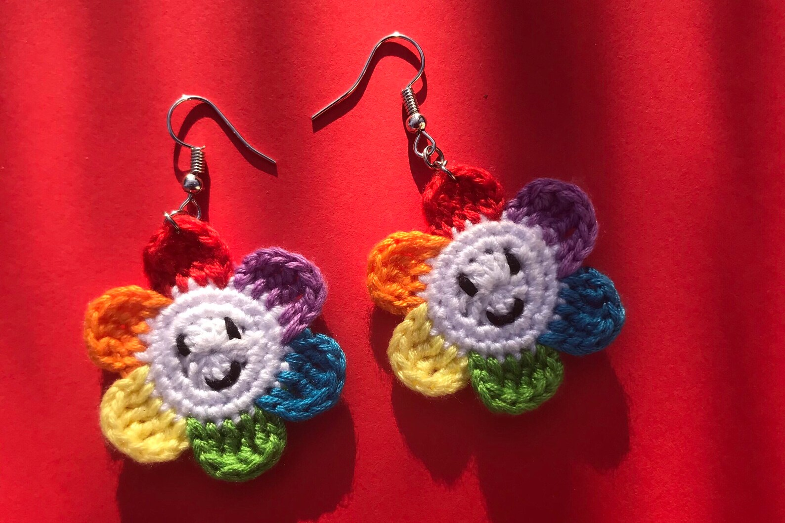
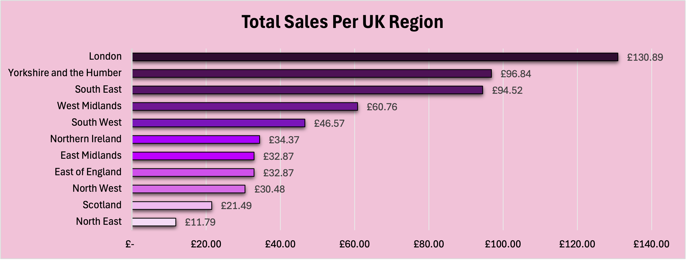
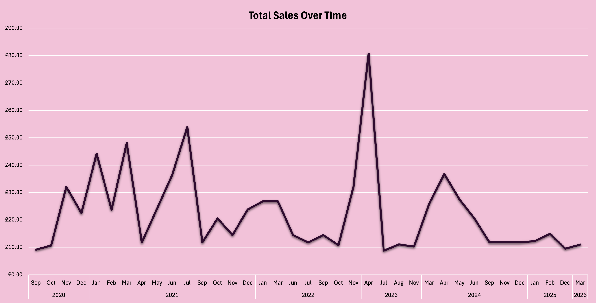
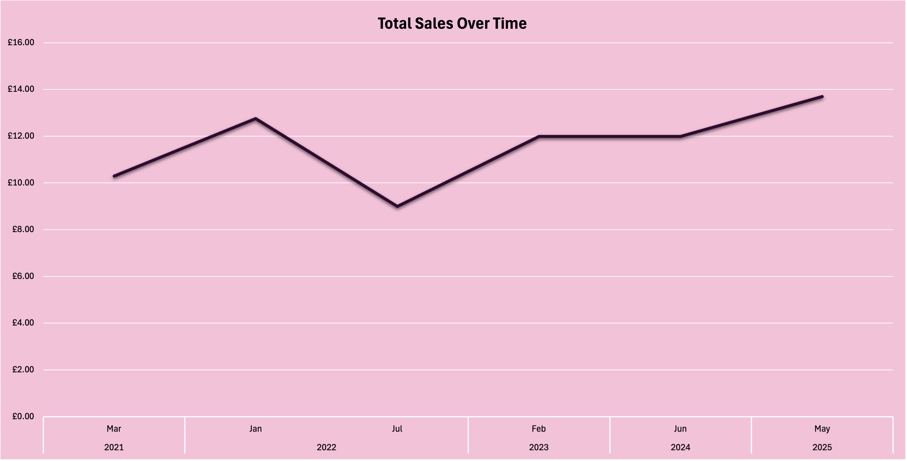

# SIS Sales Dashboard

## Introduction
Scarlett's In Stitches (SIS) is a small business I created near the end of 2020, specialising in colourful crochet earrings, which I handmake and sell on the e-commerce platform, Etsy. The dataset used for this project contains real sales and geographical information from my individual orders.

### Etsy Shop
If you’d like to view the live products, you can visit my shop here:  
ScarlettsInStitches (https://www.etsy.com/uk/shop/ScarlettsInStitches?ref=shop_sugg_market)

This dashboard aims to analyse my sales performance and determine weaker areas where there may be growth opportunities. By bringing the most important metrics on one page, such as product type and customer location, I can explore how different factors influence overall revenue and demand.

### Business Questions
1.  What is the best-selling item, and how does product performance vary across listings?  
2. How does revenue change over time, and are there identifiable seasonal patterns linked to my colourful, floral designs? 
3. Which UK regions contribute most to overall revenue?  
4. Which hardware types (e.g., hoops, hooks) perform best?  
5. How do UK sales compare to international sales?  

### Tools 
Excel was used for data cleaning, transformation, visualisation, and analysis.

## Preparing the Data
### The Dataset
Etsy's Shop Manager allows sellers to download CSV files containing order summaries for specific months or years. However, Etsy does not have an option to export all orders in a single file. Therefore, the first step in preparing the data was to manually download each CSV file from 2020 to 2026. 

To combine these individual files into one unified dataset, I used Power Query in Excel to import and append the CSVs. This created a single table that could be cleaned and transformed for analysis. To protect customer information, the raw dataset has not been included. Instead, the cleaned version is used throughout the dashboard and is hidden within the protected workbook.

### Data Cleaning
Once the CSV files were combined, the dataset was cleaned in Power Query to prepare it for transformation and analysis. The cleaning steps included:  
 
• Removing duplicate Order IDs created during the append process  
• Deleting unnecessary columns, such as Order Type (which was consistently "online") and Shipping Discount  
• Removing columns containing personal information, such as Ship Name and Address Line 1, to protect customer privacy  
• Standardising missing hardware values for listings where customers were not required to choose between hoops or hooks  
• Creating calculated columns, including Order Total (earring price + shipping)  

### Creating a UK Region Lookup
One of the business questions was to identify which UK regions generated the most sales. Etsy does not provide region‑level data, so I created it manually using the Ship City field. The steps to build the lookup table were:
 
1. Copied the main query containing all historical data and removed every column except Ship City  
2. Removed duplicates to create a unique list
3. Loaded the list into Excel and manually assigned each city to its correct UK region, marking all non-UK cities as "Non-UK" 
4. Used a Left Outer Join in Power Query to merge the region information back into the main dataset

After the dataset had been cleaned and the region information was added, it was ready to be used to build the sales dashboard and answer the business questions.

## Data Analysis
### Building the Dashboard
To build the dashboard, I used Excel’s PivotTables and PivotCharts to summarise the cleaned dataset, then added slicers for product name, hardware type, and country to make the dashboard interactive. I also connected the slicers to the relevant PivotCharts to ensure the visuals updated together. 

A timeline was also added to allow users to explore trends across different months and years. The visuals were arranged on a single page to provide a clear overview of sales performance and to support answering the business questions. The final dashboard can be seen in Figure 1.

 

  
   
  <strong>Figure 1: Final SIS Sales Dashboard</strong>

 

### Answering the Business Questions
#### 1. What is the best-selling item, and how does product performance vary across listings?
From the dashboard, the best‑selling item is the <strong>“Smiley & Sad Daisy Crochet Earrings”</strong>, which consistently outperforms all other listings. This trend holds across every country with more than one sale, including both the UK and the US; this shows that the appeal is broad rather than country-specific. Across all countries combined, this single product accounts for approximately 46% shop’s total revenue, making it the clear driver of overall sales performance (Figure 2).

 

  
   
  <strong>Figure 2: Earring Sales Per Listing</strong>

 

A similar product to the best-selling item is the "Rainbow Flower Smileys", which also features bright colours and smiley-face motifs (see Figures 3a and 3b for a comparison). Given the visual similarities, you might expect both designs to perform similarly. However, the data shows a striking preference for the Smiley & Sad Daisy Pair, which has sold over eight times more than the Rainbow Flower Smileys. This difference could be a result of several factors: the contrast between the smiley and sad faces creates a more expressive design, and the simpler yellow-and-white colour palette may appeal to customers who want something more versatile. I believe that the combination of these elements makes the Smiley & Sad Daisy earrings feel more distinctive, contributing to their higher demand.

 
<table align="center">
  <tr>
    <td align="center">
       
      <strong>Figure 3a: Smiley & Sad Daisy Earrings</strong>
    </td>
    <td align="center">
       
      <strong>Figure 3b: Rainbow Flower Smileys</strong>
    </td>
  </tr>
</table>
 

Beyond the top-performing item, there is a clear mid-tier of products that still contribute to overall revenue but do not exhibit the same level of demand as the best-seller. These include the Crochet Strawberry Earrings, Crochet Rainbow Earrings, and Crochet Tiered Rainbow Flower Earrings (Figure 2). 

At the lower end of the distribution, the Crochet Sunflower Earrings are the weakest-performing product, with only two sales across almost 6 years. This highlights either a significant gap in customer interest or suggests that the sunflower design may need to be rethought.

### 2. How does revenue change over time, and are there identifiable seasonal patterns linked to my colourful, floral designs? 
Looking at the Total Sales Over Time visual on the dashboard, 2021 stands out as the strongest year for revenue (Figure 1). This aligns with the period when I was most active on my business Instagram account, posting regularly. After 2021, sales show an overall gradual decline. This pattern corresponds with a significant reduction in social media activity as I focused on completing my University studies. 

When looking for seasonal patterns, there is no consistent cycle across the years. There are occasional peaks in months such as April 2023 and May 2024, but these do not repeat annually. The variation in sales appears to be a result of changes in shop activity and online visibility, rather than the time of year. However, it is still encouraging to see that people enjoy colourful designs all year round. 

### 3. Which UK regions contribute most to overall revenue?

As shown in Figure 4, the top three regions that contribute the most to overall revenue are:
1. London
2. Yorkshire and the Humber
3. South East

 

  
   
  <strong>Figure 4: Total Sales Per UK Region</strong>

 

London generates the most revenue, which is unsurprising given its large population. However, Yorkshire and the Humber also contributes a significant amount to sales, suggesting that demand is not limited to one specific region of the county. As a small business owner, I initially expected most sales to come from regions close to me, especially from local customers and people who know me. Instead, the data shows that my customers are far more geographically spread out than I anticipated.

### 4. Which hardware types (e.g., hoops, hooks) perform best? 
For most of my listings, customers have the option to choose whether they want hoops or hooks as the hardware type. The dashboard shows that hooks account for the vast majority of sales, with hoops making up around 8% of sales (Figure 5b). This indicates a clear customer preference for hooks across almost all product types.

 

  
  

  <strong>5a. Hooks</strong> &emsp;&emsp;&emsp;&emsp;&emsp;&emsp;&emsp;&emsp;&emsp;&emsp;          &emsp;&emsp;&emsp;&emsp;&emsp;&emsp;&emsp;&emsp;&emsp;&emsp;
  <strong>5b. Hoops</strong>

<strong>Figure 5. Total Sales Over Time for Earrings with Hooks (5a) and Hoops (5b)</strong>

 

### 5. How do UK sales compare to international sales?
UK sales account for around 65% of total revenue, making the UK the primary market for my shop. This is expected, as UK orders avoid the higher costs of international shipping and are delivered faster than non-UK orders.

International sales make up the remaining share, but a significant portion of the revenue from these orders goes toward higher shipping costs. Among international customers, the United States is by far the strongest market, representing approximately 80% of all international orders. This shows that my products have a strong appeal outside the UK, particularly in the US.

However, I had to stop shipping to the US in August 2025 due to newly introduced tariffs, which made international postage too expensive for both my customers and me. This likely explains the drop in international sales after that point and shows how external factors can influence small business performance.

## Strategic Recommendations

Here, I revisit my business questions and share my business recommendations based on the insights that the sales dashboard has revealed for Scarlett's In Stitches.

### Business Questions
1.  What is the best-selling item, and how does product performance vary across listings?  
2. How does revenue change over time, and are there identifiable seasonal patterns linked to my colourful, floral designs? 
3. Which UK regions contribute most to overall revenue?  
4. Which hardware types (e.g., hoops, hooks) perform best?  
5. How do UK sales compare to international sales?  

## Recommendations 

•  Create more smiley/sad products, introducing new colours, shapes and sizes, as these designs performed the best  
•  Revisit the design of the Crochet Sunflower Earrings, which showed the lowest sales  
•  Increase visibility through consistent social media activity, focusing especially on best‑selling designs like the Smiley & Sad Daisy Crochet Earrings  
•  Prioritise hooks when restocking hardware, as they account for the majority of customer preferences, thus reducing unnecessary stock costs  
•  Target Etsy ads towards London, Yorkshire and the Humber, and the South East to maximise advertising impact  
•  Explore other international markets beyond the US, such as Canada and Australia, to boost international sales, as I can no longer afford to ship to the US  
• As there is no clear seasonal pattern in sales, I can continue to make colourful and fun designs!  

