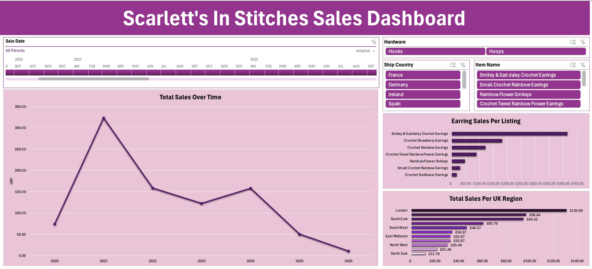

# SIS Sales Dashboard

## Introduction
Scarlett's In Stitches (SIS) is a small business I created near the end of 2020, specialising in colourful crochet earrings, which I handmake and sell on the e-commerce platform, Etsy. The dataset used for this project contains real sales and geographical information from my individual orders.

This dashboard aims to analyse my sales performance and determine weaker areas where there may be growth opportunities. By bringing the most important metrics on one page, such as product type and customer location, I can explore how different factors influence overall revenue and demand.

### Business Questions
1.  What is the best-selling item, and how does product performance vary across listings?  
2.  Which products should be prioritised for marketing strategies?  
3. How does revenue change over time, and are there identifiable seasonal patterns linked to my colourful, floral designs? 
4. Which UK regions contribute most to overall revenue?  
5. Which hardware types (e.g., hoops, hooks) perform best?  
6. How do UK sales compare to international sales?  

### Tools 
Excel was used for data cleaning, transformation, visualisation, and analysis.

## Preparing the Data
### The Dataset
Etsy's Shop Manager allows sellers to download CSV files containing order summaries for specific months or years. However, Etsy does not have an option to export all orders in a single file. Therefore, the first step in preparing the data was to manually download each CSV file from 2020 to 2026. 

To combine these individual files into one unified dataset, I used Power Query in Excel to import and append the CSVs. This created a single table that could be cleaned and transformed for analysis. To protect customer information, the raw dataset has not been included. Instead, the cleaned version is used throughout the dashboard and is hidden within the protected workbook.

### Data Cleaning
Once the CSV files were combined, the dataset was cleaned in Power Query to prepare it for transformation and analysis. The cleaning steps included:  
 
• Removing duplicate Order IDs created during the append process  
• Deleting unnecessary columns, such as Order Type (which was consistently "online") and Shipping Discount  
• Removing columns containing personal information, such as Ship Name and Address Line 1, to protect customer privacy  
• Standardising missing hardware values for listings where customers were not required to choose between hoops or hooks  
• Creating calculated columns, including Order Total (earring price + shipping)  

### Creating a UK Region Lookup
One of the business questions was to identify which UK regions generated the most sales. Etsy does not provide region‑level data, so I created it manually using the Ship City field. The steps to build the lookup table were:
 
1. Copied the main query containing all historical data and removed every column except Ship City  
2. Removed duplicates to create a unique list
3. Loaded the list into Excel and manually assigned each city to its correct UK region, marking all non-UK cities as "Non-UK" 
4. Used a Left Outer Join in Power Query to merge the region information back into the main dataset

After the dataset had been cleaned and the region information was added, it was ready to be used to build the sales dashboard and answer the business questions.

## Data Analysis
### Building the Dashboard
To build the dashboard, I used Excel’s PivotTables and PivotCharts to summarise the cleaned dataset, then added slicers for product name, hardware type, and country to make the dashboard interactive. I also connected the slicers to the relevant PivotCharts to ensure the visuals updated together. 

A timeline was also added to allow users explore trends across different months and years. The visuals were arranged on a single page to provide a clear overview of sales performance and to support answering the business questions. The final dashboard can be seen in Figure 1.

  
   
  <strong>Figure 1: Final SIS Sales Dashboard</strong>

### Answering the Business Questions
#### 1. What is the best-selling item, and how does product performance vary across listings?
From the dashboard, the best‑selling item is the <strong>“Smiley & Sad Daisy Crochet Earrings”</strong>, which consistently outperforms all other listings. This trend holds across every country with more than one sale, including both the UK and the US. Across all regions combined, this single product accounts for over half of the shop’s total revenue, making it the clear driver of overall sales performance (Figure 2).

A similar product to the best-selling item is the "Rainbow Flower Smileys", which also features bright colours and smiley-face motifs (see Figure 4 for a comparison). Given the visual similarities, you might expect both designs to perform similarly. However, the data shows a striking preference for the Smiley & Sad Daisy Pair, which has sold over eight times more to the Rainbow Flower Smileys. This difference could be as a result of several factors. The contrast between the smiley and sad faces creates a more expressive design, and the simpler yellow-and-white colour pallet may appeal to customers who want something more versatile. I believe that the combination of these elements make the Smiley & Sad Daisy earrings feel more distinctive, contributing to their higher demand.

